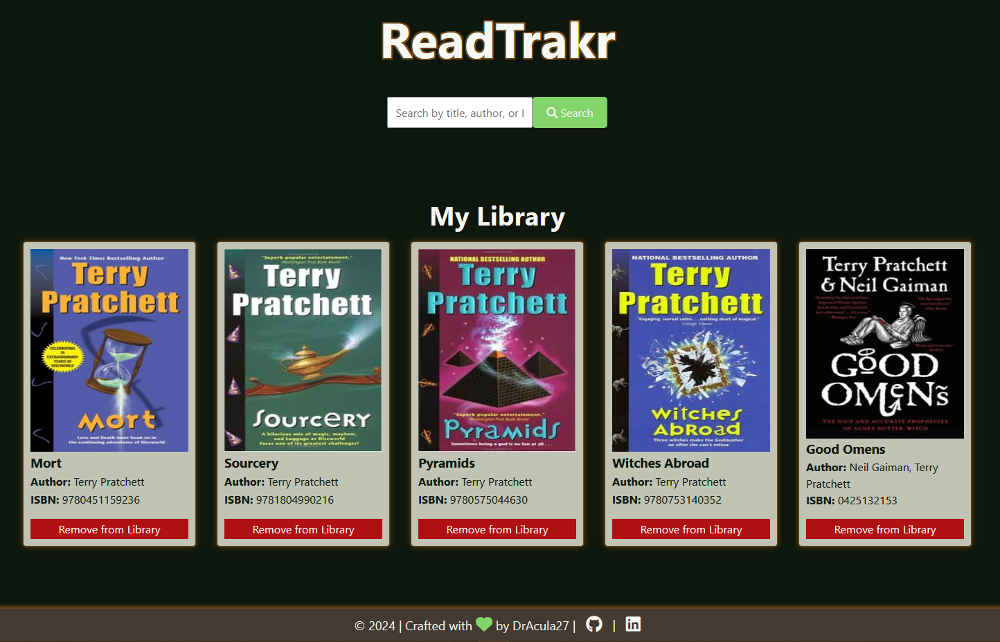

<!-- Improved compatibility of back to top link: See: https://github.com/othneildrew/Best-README-Template/pull/73 -->

<!-- PROJECT LOGO -->
 

  

  <h3 align="center">ReadTrakr</h3>

  

    Search for and add books to your personal library!
     
    <a href="https://dracula27.github.io/readTrakr/">View Demo</a>
  

<!-- TABLE OF CONTENTS -->

  
Table of Contents

  <ol>
    <li>
      <a href="#about-the-project">About The Project</a>
      <ul>
        <li><a href="#built-with">Built With</a></li>
      </ul>
    </li>
    <li><a href="#usage">Usage</a></li>
    <li><a href="#optimizations">Optimizations</a></li>
    <li><a href="#lessons-learned">Lessons Learned</a></li>
    <li><a href="#contact">Contact</a></li>
    <li><a href="#acknowledgments">Acknowledgments</a></li>
  </ol>

<!-- ABOUT THE PROJECT -->

## About The Project

    

Keep track of every book you have read with this simple app! Search for a book by title, author, or ISBN and add it to your own personal library.

Bonus: it is service-agnostic! No matter how you read your books (iBooks, Kindle, real-life physical books, etc.) you can log all your reading progress here.

(<a href="#readme-top">back to top</a>)

### Built With

- 
- 
- 

(<a href="#readme-top">back to top</a>)

<!-- USAGE -->

## Usage

Type the title, author, or ISBN of a book you'd like to add to your library and either type the `Enter` key or click the `Search` button to display the book results.

- Click the `Add to Library` button to add your book to your library.
- The book will stay in your library even if you close your browser!
- If you decide you no longer want a book in your library, click the `Remove from Library` button at the bottom of the book's card in the 'My Library' section.

(<a href="#readme-top">back to top</a>)

<!-- OPTIMIZATIONS -->

## Optimizations

This project can be improved by:

- [ ] Refactoring the code to account for errors fetching data,
- [ ] Replacing the alert with more custom functionality when telling the user a book is already in their library,
- [ ] Adding a `Clear Search Results` button,
- [x] Ensuring all book cover images are the same size,
- [ ] Adding a confirmation modal when a user clicks the `Remove from Library` button on a book,
- [ ] Adding a loading icon while the fetch is in progress.

(<a href="#readme-top">back to top</a>)

<!-- LESSONS LEARNED -->

## Lessons Learned

- **API Integration.** When getting the data from the Open Library API, I learned how to use `fetch` to get `JSON` data from an external source and use the results of one query to make another query for getting the book covers.
- **Data Manipulation.** Once I had the data from the Open Library API, I learned how to transform that data into a format I needed for the project.

(<a href="#readme-top">back to top</a>)

<!-- CONTACT -->

## Contact

Danielle Andrews - [@DrAcula_codes](https://twitter.com/DrAcula_codes 'Twitter/X') - [daniellerandrews](https://www.linkedin.com/in/daniellerandrews 'LinkedIn') - danielle.andrews.dev@icloud.com

Project Link: [https://github.com/DrAcula27/readTrakr](https://github.com/DrAcula27/readTrakr)

(<a href="#readme-top">back to top</a>)

<!-- ACKNOWLEDGMENTS -->

## Acknowledgments

A special thanks to these resources used in the project!

- [Open Library APIs](https://openlibrary.org/developers/api)
- [GitHub Pages](https://pages.github.com)
- [Font Awesome](https://fontawesome.com)

(<a href="#readme-top">back to top</a>)

